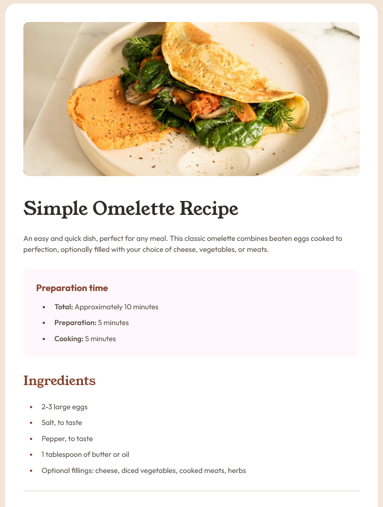

# Frontend Mentor - Recipe page solution

This is a solution to the [Recipe page challenge on Frontend Mentor](https://www.frontendmentor.io/challenges/recipe-page-KiTsR8QQKm). Frontend Mentor challenges help you improve your coding skills by building realistic projects.

## Table of contents

- [Frontend Mentor - Recipe page solution](#frontend-mentor---recipe-page-solution)
  - [Table of contents](#table-of-contents)
  - [Overview](#overview)
    - [Screenshot](#screenshot)
    - [Links](#links)
  - [My process](#my-process)
    - [Built with](#built-with)
    - [What I learned](#what-i-learned)
  - [Author](#author)

## Overview

### Screenshot



### Links

- Live Site URL: [Recipe Page](https://rohan843-recipe-page.netlify.app/)

## My process

### Built with

- Semantic HTML5 markup
- CSS custom properties
- Flexbox
- [React](https://reactjs.org/) - JS library

### What I learned

Majorly, the following (retrospectively, not that complex) method to add space between a list item and the list marker:

```html
<ol>
  <li>Extra Spacing!</li>
  <li>Regular Spacing</li>
</ol>
```

```css
li:first-child {
  padding-left: 20px;
}
```

## Author

- Website - [Rohan Sharma](https://rohan843.netlify.app/)
- Frontend Mentor - [@rohan843](https://www.frontendmentor.io/profile/rohan843)
